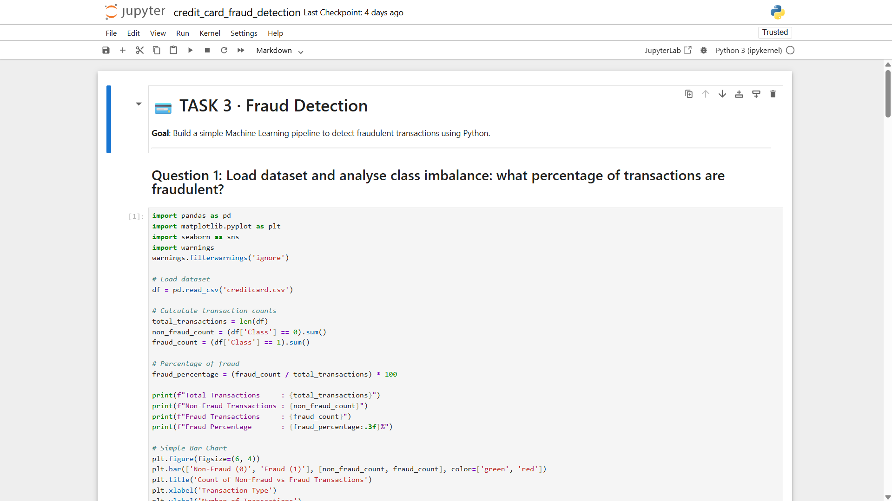
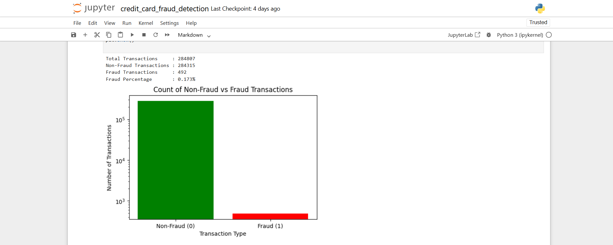
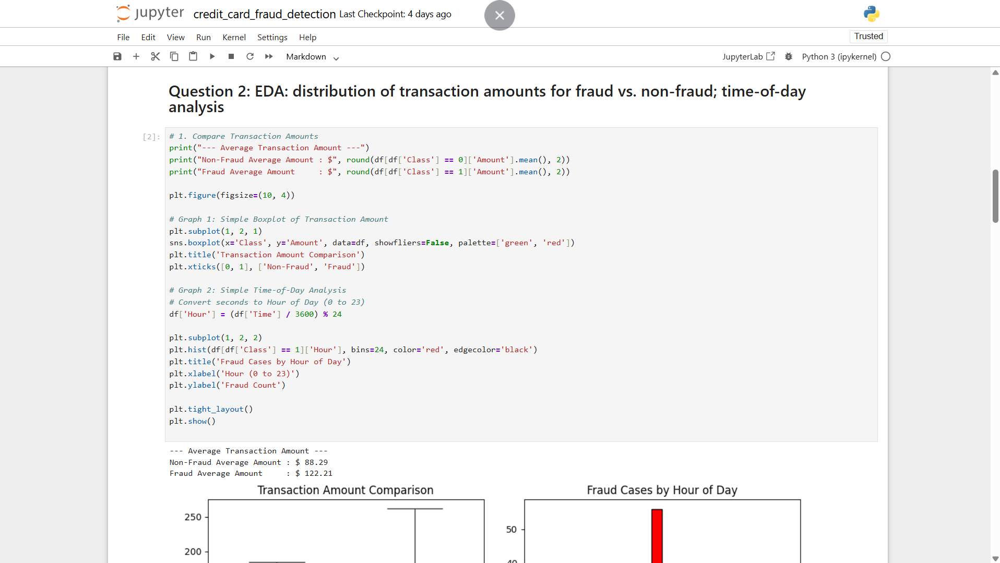
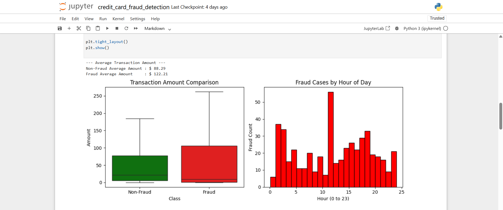
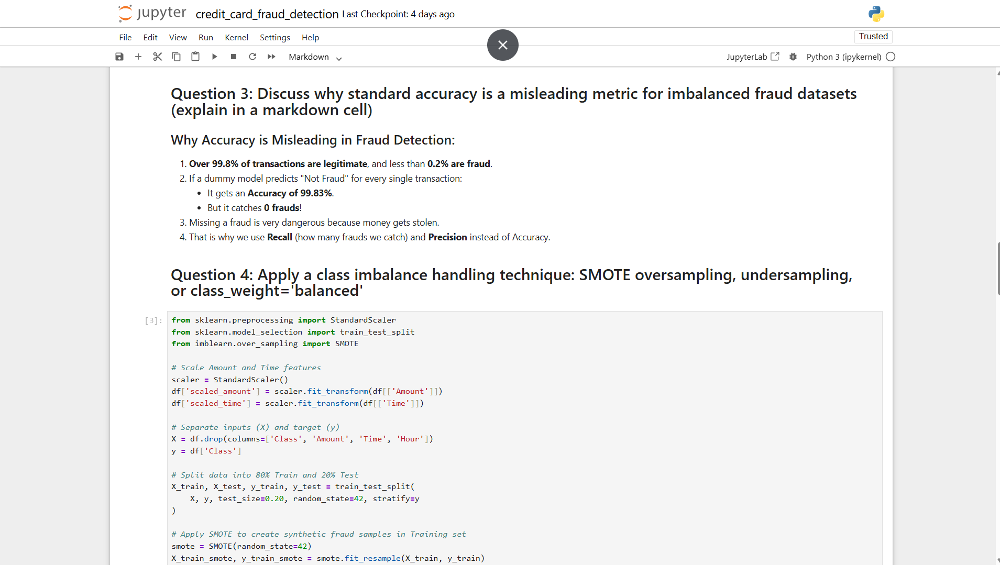
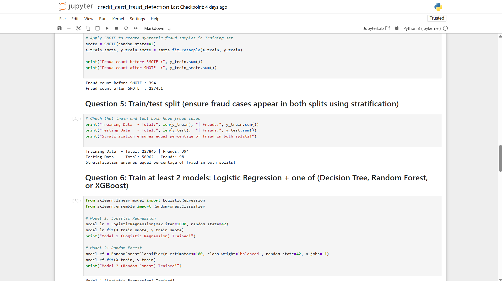
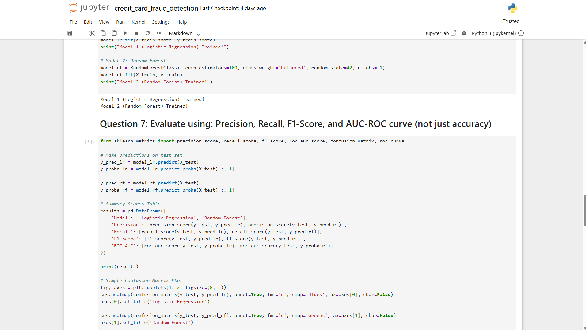
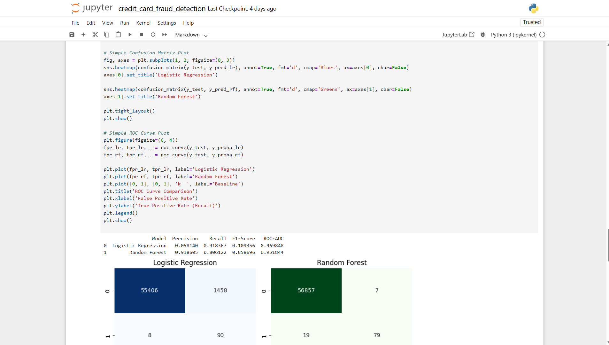
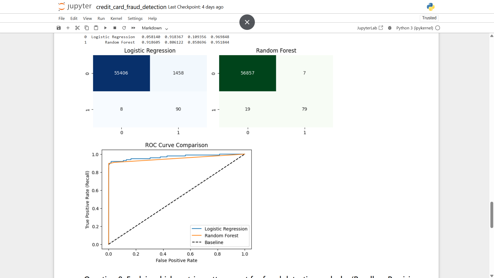
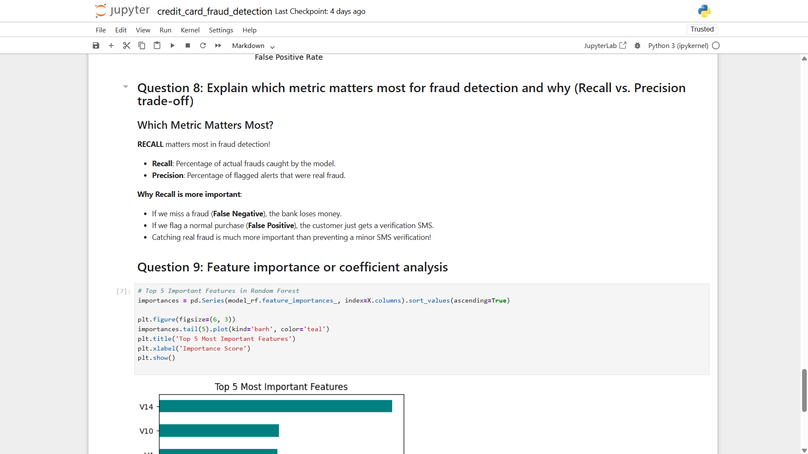

# 💳 Credit Card Fraud Detection

A simple, beginner-friendly Machine Learning pipeline to detect fraudulent credit card transactions using Python. 🕵️‍♂️


---

## 📌 About the Project

Fraudulent transactions make up a tiny fraction of all credit card transactions — but catching them matters a lot 💰. This project walks through a complete, easy-to-follow ML workflow:

- 📊 Exploring & visualizing an **imbalanced dataset**
- ⚖️ Handling **class imbalance** with SMOTE
- 🤖 Training **Logistic Regression** & **Random Forest** models
- 📈 Evaluating with **Precision, Recall, F1-Score & ROC-AUC** (not just accuracy!)
- 🔍 Understanding **which features matter most**
- 🚀 Discussing how to **scale** it to real-world traffic

---

## 🗂️ Dataset

- **File**: `creditcard.csv`
- **Total Transactions**: `284,807`
- **Fraudulent Transactions**: `492` (only **0.173%** 😱)
- **Features**: `V1`–`V28` (PCA-transformed, anonymized), `Time`, `Amount`, `Class` (target: `0` = Non-Fraud, `1` = Fraud)

> ⚠️ Due to size/privacy, the dataset isn't included in this repo. Download it from [Kaggle - Credit Card Fraud Detection](https://www.kaggle.com/mlg-ulb/creditcardfraud) and place `creditcard.csv` in the project root.

---

## 🛠️ Tech Stack

| Tool | Purpose |
|------|---------|
| 🐍 Python | Core programming language |
| 🐼 Pandas | Data loading & manipulation |
| 📊 Matplotlib / Seaborn | Data visualization |
| 🧪 Scikit-learn | ML models & evaluation metrics |
| ⚖️ imbalanced-learn (SMOTE) | Handling class imbalance |
| 📓 Jupyter Notebook | Development environment |

---

## 🚀 Getting Started

### 1️⃣ Clone the repository
```bash
git clone https://github.com/<your-username>/credit-card-fraud-detection.git
cd credit-card-fraud-detection
```

### 2️⃣ Install dependencies
```bash
pip install pandas matplotlib seaborn scikit-learn imbalanced-learn jupyter
```

### 3️⃣ Add the dataset
Place `creditcard.csv` in the project root folder (see [Dataset](#️-dataset) section above).

### 4️⃣ Run the notebook
```bash
jupyter notebook credit_card_fraud_detection.ipynb
```

---

## 📝 Project Walkthrough

### ❓ Question 1: Class Imbalance Analysis
Loaded the dataset and checked how imbalanced it is.

- Total Transactions: **284,807**
- Non-Fraud: **284,315**
- Fraud: **492**
- Fraud Percentage: **0.173%**

<p align="center">
  
  <br/>
  
</p>

---

### 🔎 Question 2: EDA — Amount Distribution & Time-of-Day Analysis
Compared transaction amounts for fraud vs. non-fraud, and looked at when fraud happens throughout the day.

- Non-Fraud Average Amount: **$88.29**
- Fraud Average Amount: **$122.21**

<p align="center">
  
  <br/>
  
</p>

---

### ⚠️ Question 3: Why Accuracy is Misleading
- Over **99.8%** of transactions are legitimate, less than **0.2%** are fraud.
- A dummy model that always predicts "Not Fraud" gets **99.83% accuracy** — but catches **0 frauds**! 🚨
- That's why **Recall** and **Precision** matter more than plain accuracy here.

---

### ⚖️ Question 4: Handling Class Imbalance (SMOTE)
Used **SMOTE** (Synthetic Minority Oversampling) to balance the training data.

- Fraud count before SMOTE: **394**
- Fraud count after SMOTE: **227,451**

<p align="center">
  
</p>

---

### ✂️ Question 5: Stratified Train/Test Split
Made sure fraud cases appear proportionally in both training and testing sets.

- Training Data: **227,845** total | **394** frauds
- Testing Data: **56,962** total | **98** frauds

---

### 🤖 Question 6: Model Training
Trained two models:
- **Logistic Regression** (on SMOTE-balanced data)
- **Random Forest** (with `class_weight='balanced'`)

<p align="center">
  
</p>

---

### 📊 Question 7: Model Evaluation
Evaluated both models using **Precision, Recall, F1-Score, and ROC-AUC** — plus confusion matrices and ROC curves.

| Model | Precision | Recall | F1-Score | ROC-AUC |
|-------|-----------|--------|----------|---------|
| Logistic Regression | 0.058 | **0.918** | 0.109 | **0.970** |
| Random Forest | **0.919** | 0.806 | **0.859** | 0.952 |

<p align="center">
  
  <br/>
  
  <br/>
  
</p>

---

### 🎯 Question 8: Recall vs. Precision — Which Matters More?

**Recall matters most in fraud detection!** 🏆

- **Recall** = % of actual frauds caught by the model.
- **Precision** = % of flagged alerts that were real fraud.
- Missing a fraud (**False Negative**) → the bank loses money. 💸
- Flagging a normal purchase (**False Positive**) → customer just gets a verification SMS. 📱
- Catching real fraud is far more important than avoiding a minor false alarm!

---

### 🔍 Question 9: Feature Importance
Identified the top 5 most important features driving the Random Forest model's predictions (led by `V14` and `V10`).

<p align="center">
  
</p>

---

### 📈 Question 10: Scalability — 1 Million Transactions/Hour

1 million transactions/hour ≈ **~278 transactions per second**. To handle this at scale:

1. ⚡ **Fast Prediction API** — Serve the model via a lightweight API (e.g., FastAPI) for predictions under 10ms.
2. 📬 **Message Queue** — Use Apache Kafka to queue incoming transactions without slowing down checkouts.
3. ☁️ **Cloud Auto-Scaling** — Host on AWS/GCP with servers that automatically scale up under heavy traffic.

---

## 📁 Project Structure

```
credit-card-fraud-detection/
│
├── credit_card_fraud_detection.ipynb   # Main notebook (all 10 questions)
├── creditcard.csv                       # Dataset (not included — see above)
├── screenshots/                         # Notebook screenshots used in this README
└── README.md                            # You are here 📍
```

---

## 🏆 Key Takeaways

- ✅ Accuracy is a trap for imbalanced datasets — use **Recall, Precision, F1, ROC-AUC** instead.
- ✅ **SMOTE** helps balance training data so models learn fraud patterns better.
- ✅ **Random Forest** gave the best overall balance of precision & recall; **Logistic Regression** caught more frauds but with far more false alarms.
- ✅ In fraud detection, a **higher Recall** is usually preferred, even at the cost of some Precision.

---

## 🤝 Contributing

Contributions, issues, and feature requests are welcome! Feel free to check the [issues page](../../issues).

## 📄 License

This project is licensed under the **MIT License**.

---

<p align="center">Made with ❤️ and Python 🐍</p>

